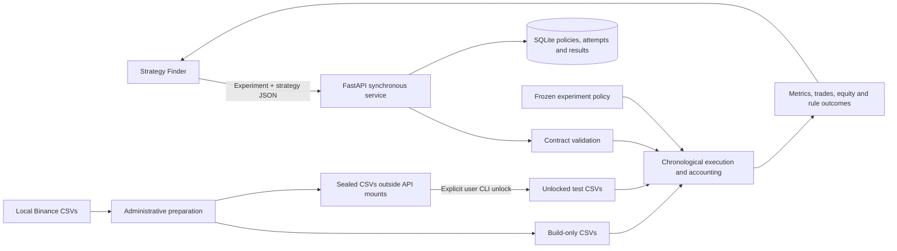

# AM Backtesting Engine

A synchronous Python service that executes declarative, long-only spot crypto strategies for an AI-assisted Investment Strategy Finder. It simulates historical trades, applies costs, checks frozen evaluation rules, and returns reproducible results. It does not generate trading ideas or place broker orders.

## Architecture



The strategist owns family selection, its pre-test discovery ledger, candidate generation/mutation, batch orchestration, notes, and search reports. The engine executes and evaluates candidates and provides correlation retention. A batch of 25 is initially 25 sequential HTTP requests. There is no queue, pub-sub broker, or polling job protocol. One simulation runs at a time; concurrent submissions receive HTTP 429 and can retry.

The API persists candidate attempts before simulation and completed results afterward. Repeating the same candidate ID and identical request returns the stored result; reusing an ID for a different strategy/configuration fails. Experiments are immutable: create a new ID to change the maximum drawdown or other settings. These new experiments do not retroactively reclassify old results.

## Start with Docker Compose

Keep your 15 source CSVs in local `prices/`. Large market data and generated partitions are excluded from Git. Docker is required for these commands:

```bash
docker compose build
docker compose --profile tools run --rm prepare
docker compose --profile tools run --rm prove
docker compose up -d engine
```

Preparation partitions data into `data/build/modern`, `data/build/xmr`, and `data/sealed/...`. It refuses to overwrite an existing dataset. It performs timestamp validation and partitioning, without testing real strategies. Proof prints the rules and all three checks and exits nonzero on failure. The API refuses backtests unless its persisted proof matches the current engine source and rule files.

After proof passes, the service is at `http://localhost:8000`; interactive Swagger documentation is at `/docs`, and OpenAPI is at `/openapi.json`. The host port binds only to localhost. Keep the service on a trusted private Docker network when connecting the strategist; authentication and public deployment are outside this version's scope.

The engine container mounts build and explicitly unlocked data, never raw prices or sealed directories. The preparation container alone sees raw prices. The `prove` container sees no market data. Mounts, not a promise inside strategy code, enforce the service boundary.

## Contracts and examples

The committed [OpenAPI contract](contracts/openapi.json), [strategy schema](contracts/strategy.schema.json), and [interface guide](docs/contracts.md) describe inputs, outputs, validation, metrics, errors, and data administration. Two complete example requests are included:

- [20/50 moving-average crossover with volatility filter](examples/crossover.json): allocate 10% of equity at entry and exit on the opposite crossover.
- [Positive 90-day momentum ranking](examples/momentum.json): hold the top five equally and rebalance at Monday 00:00 UTC using the preceding close. Assets without enough history are ineligible.

Create an experiment, then submit a candidate synchronously:

```bash
curl -H 'Content-Type: application/json' --data-binary @examples/experiment.json http://localhost:8000/v1/experiments
curl -H 'Content-Type: application/json' --data-binary @examples/crossover.json http://localhost:8000/v1/backtests
```

These are usage examples, not authorization to run a strategy search. The implementation work runs only synthetic strategies.

Supported strategy operations: SMA, EMA, returns, volatility, rolling minima/maxima; hourly or completed daily feature windows; arithmetic, comparisons, positive lags, boolean combinations and crossovers; filtering, ranking, fixed entry allocations, equal-weight rebalancing, holding-time exits, and hourly/daily/weekly UTC schedules. No Python plugins, arbitrary expressions, callbacks, uploaded price signals, or code evaluation. Unsupported inputs fail validation.

## Rules and price data

[config/rules.md](config/rules.md) is the authoritative written policy; [defaults](config/defaults.json) set the agreed initial experiment values, and [proof criteria](config/proof.json) fix synthetic acceptance criteria before execution.

Defaults: 1,000 USDT, no borrowing, 300 completed trades, Revolut X Portugal/EEA 9bps taker fees plus 5bps adverse execution per side, return above the assumed 2% yielding-cash benchmark, drawdown strictly below 20%, and positive returns in at least two of three chronological chunks. Compare correlated survivors at daily frequency; above 0.7, keep the better qualifying strategy. Drawdown is configurable for each newly created experiment. Alpaca is a separate fixed 25bps taker-cost profile with fees deducted from the received asset. Idle trading cash earns zero; the 2% yield belongs to the benchmark. No withdrawal income is assumed.

The price source remains Binance USDT candles. Revolut's [public EEA pair snapshot](config/revolut-pairs-eea.json), dated 5 October 2026, supplies current base quantity increments and limits for relevant USDC pairs where available. USDT notional constraints remain explicit research proxies; Alpaca asset constraints require an authenticated snapshot and currently use research proxies. Historical availability, venue spreads and liquidity are not reconstructed from these candles. No USD/USDC/USDT conversion is inferred. Some historical assets have no current corresponding Revolut pair, so backtest qualification is not a guarantee of live tradability.

HYPE is excluded. XMR ends in February 2024 because trading ceased, as confirmed by the user. Its historical track uses an explicitly assumed scheduled liquidation at the final recorded open; subsequent trading is prohibited. This settlement includes costs and fractional dust, but is not a verified historical venue fill.

For internal gaps up to four hours, carry the last observed close and mark synthetic bars. Never interpolate toward a future price. Volume/activity stays unknown; decisions and fills are skipped on synthetic hours. Longer gaps suspend features until valid lookbacks recover, with stale valuations disclosed. Histories never shrink to the intersection of all assets. Read the [inspection report](docs/data-inspection.md) for coverage and timing evidence.

## Sealed evaluation

Modern: build before 5 October 2024; holdout from that instant to the exclusive end 5 October 2026. XMR: build before 20 February 2022; holdout until the exclusive end 20 February 2024 03:00 UTC. The XMR track contains only XMR, preventing post-2022 modern history from contaminating its historical experiment. The earlier timestamp/completeness inspection is disclosed; no real strategy has been evaluated during implementation.

Only when the user explicitly authorizes spending a holdout, run the administrative command on the host:

```bash
python -m am_backtesting unlock --track modern --acknowledge-unseen-data-is-spent
```

There is no API unlock endpoint. The command copies that track into `data/unlocked` and writes an unlock receipt. Afterward, create a separate candidate ID with `period: "test"`. Test warmup can read preceding build observations; test results cannot be used by the retention endpoint. Repeated testing after unlock is possible, but the history is no longer unseen. For XMR use `--track xmr`.

## Tests, proof, and libraries

```bash
python -m venv .venv
# Activate the virtual environment for your shell, then:
pip install -e '.[test]'
pytest -q
ruff check .
ruff format --check .
python -m am_backtesting prove
```

GitHub Actions repeats unit/integration tests and proof, verifies the committed OpenAPI contract, builds and tests the Docker image, and smoke-tests the container API. The [synthetic proof report](reports/synthetic-proof.json) records fixed fixtures and outcomes. A failed check blocks real strategies. Print the rules/results and stop after proof; no discovery loop starts automatically.

The execution/accounting core is purpose-written and uses no third-party backtesting framework. NumPy 2.3.5 and pandas 3.0.1 provide arrays, rolling calculations, and time-series handling. Pydantic 2.13.5 validates contracts; FastAPI 0.142.2 generates OpenAPI and serves synchronous endpoints; Uvicorn 0.54.0 runs the server. SQLite is Python's standard-library persistence. pytest and HTTPX support testing; Ruff checks code quality.

Synchronous performance must be measured on representative complete simulations. The initial 16-file CSV inspection took about 2.2 seconds for parsing and timestamp checks, not backtesting. Full fills are assumed at the next observed open adjusted for costs; no order-book depth, intrahour stop fills, or live broker integration is claimed.

A [synthetic performance measurement](reports/synchronous-benchmark.json) matching 14 assets and 76,602 hours per asset took 7.223 seconds for weekly 90-day momentum simulation plus 0.070 seconds for JSON serialization locally. It excludes HTTP, SQLite and source parsing, and does not predict all strategy runtimes. Configure the strategist's initial request timeout to 120 seconds and submit one candidate per request; review that limit using measured workloads.
